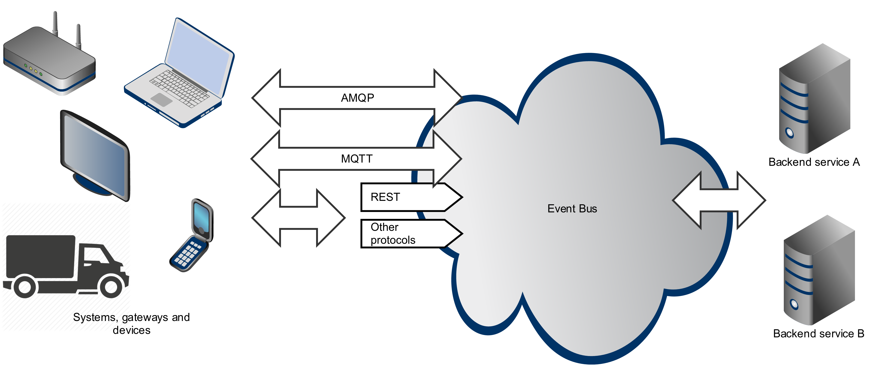

# Streamok - data streams for connected devices

Streamok is a data stream platform for connected devices, where device can be a piece of the IoT (Internet Of Things) hardware, smart phone, tablet, web browser or external IT system.

The idea behind Streamok is to deliver a scalable backend platform providing core services required by device-oriented systems. List of such services includes IoT-scale messaging infrastructure, device management, telemetry reading/writing, machine learning, big data analytics and so forth.

Streamok is based on the top of the leading open source projects including [Eclipse Vert.x](http://vertx.io/), [Apache Spark](http://spark.apache.org/) and [CentOS](https://www.centos.org/).

## Documentation

Streamok documentation is available [here](https://streamok.gitbooks.io/streamok/content).